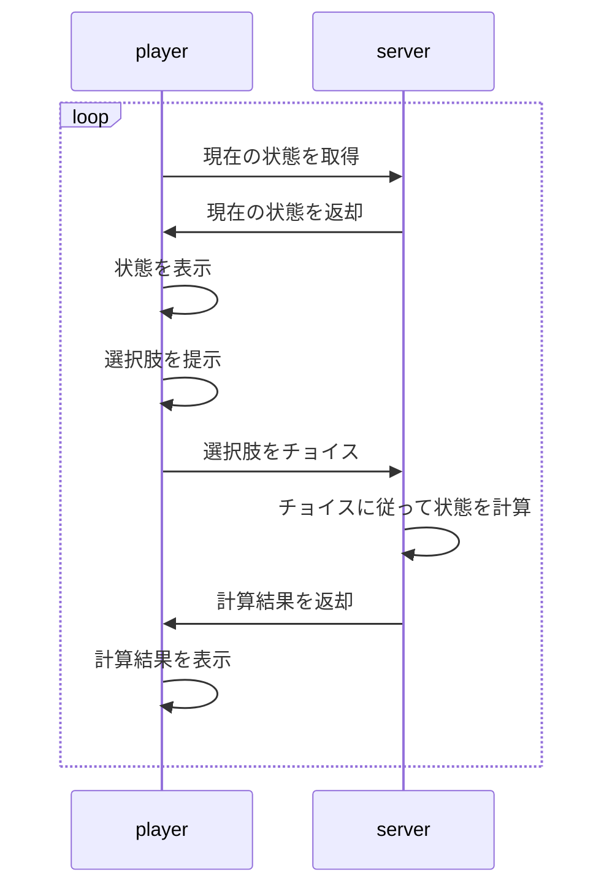

## インタラクション

```mermaid
sequenceDiagram
loop
    player->>server: 現在の状態を取得
    server->>player: 現在の状態を返却
    player->>player: 状態を表示
    player->>player: 選択肢を提示
    player->>server: 選択肢をチョイス
    server->>server: チョイスに従って状態を計算
    server->>player: 計算結果を返却
    player->>player: 計算結果を表示
end
```
