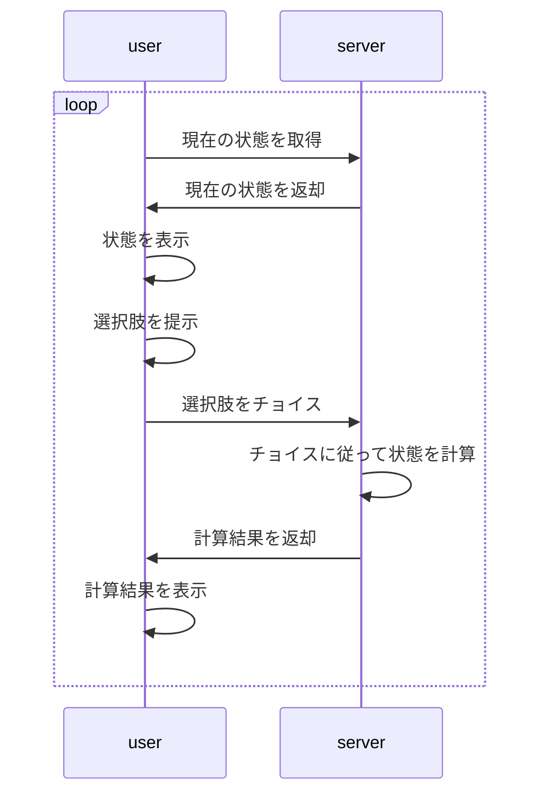

## インタラクション

```mermaid
sequenceDiagram
loop
    user->>server: 現在の状態を取得
    server->>user: 現在の状態を返却
    user->>user: 状態を表示
    user->>user: 選択肢を提示
    user->>server: 選択肢をチョイス
    server->>server: チョイスに従って状態を計算
    server->>user: 計算結果を返却
    user->>user: 計算結果を表示
end
```
