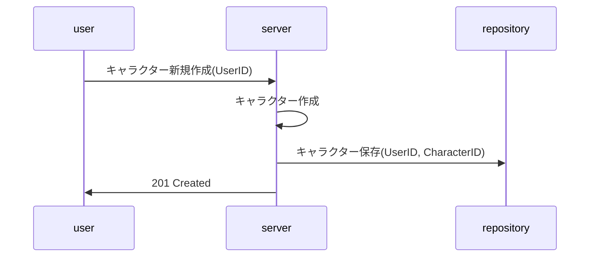
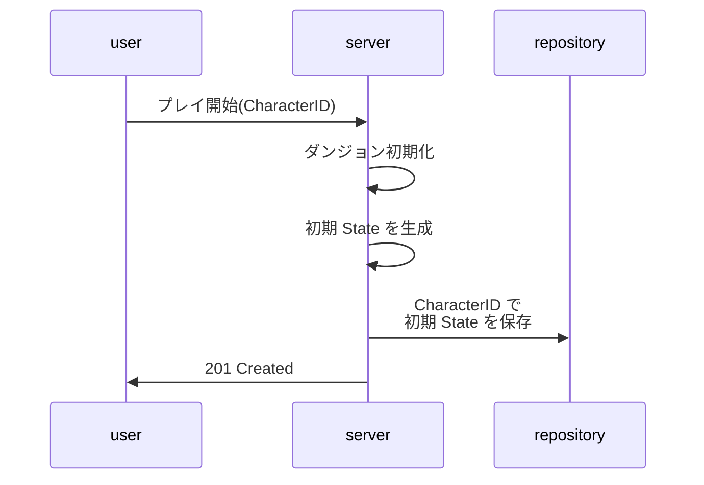
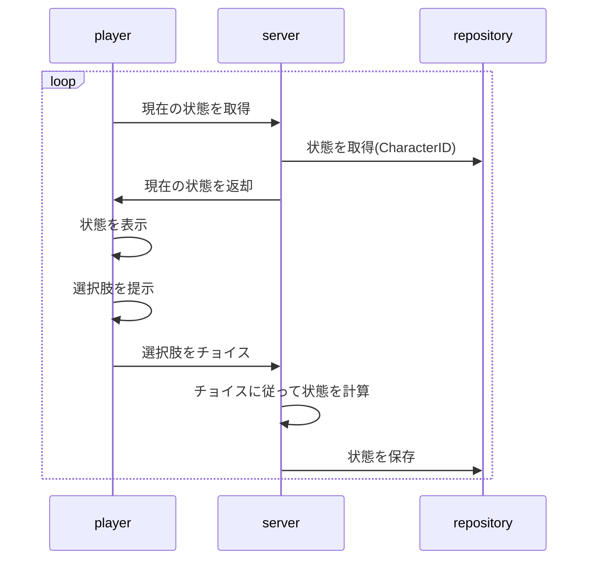
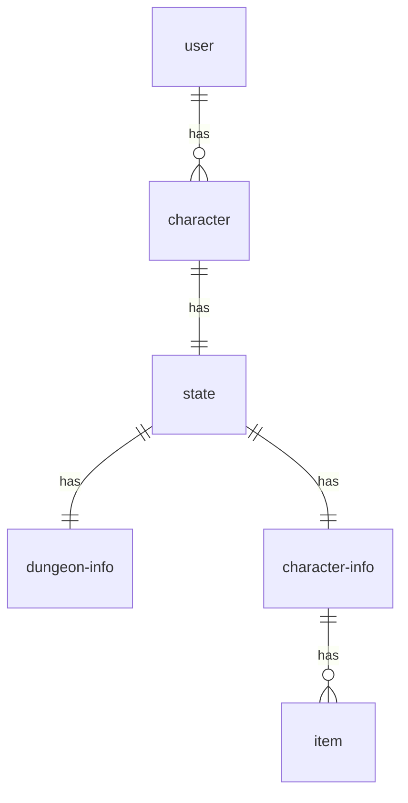

## 新しくキャラクターを作成

```mermaid
sequenceDiagram
    user->>server: キャラクター新規作成(UserID)
    server->>server: キャラクター作成
    server->>repository: キャラクター保存(UserID, CharacterID)
    server->>user: 201 Created
```

## 新しくプレイを開始

```mermaid
sequenceDiagram
    user->>server: プレイ開始(CharacterID)
    server->>server: ダンジョン初期化
    server->>server: 初期 State を生成
    server->>repository: CharacterID で<br>初期 State を保存
    server->>user: 201 Created
```

## インタラクション

```mermaid
sequenceDiagram
loop
    player->>server: 現在の状態を取得
    server->>repository: 状態を取得(CharacterID)
    server->>player: 現在の状態を返却
    player->>player: 状態を表示
    player->>player: 選択肢を提示
    player->>server: 選択肢をチョイス
    server->>server: チョイスに従って状態を計算
    server->>repository: 状態を保存
end
```

## ER図

```mermaid
erDiagram
    user ||--o{ character : has
    character ||--|| state : has
    state ||--|| dungeon-info : has
    state ||--|| character-info : has
    character-info ||--o{ item : has
```
